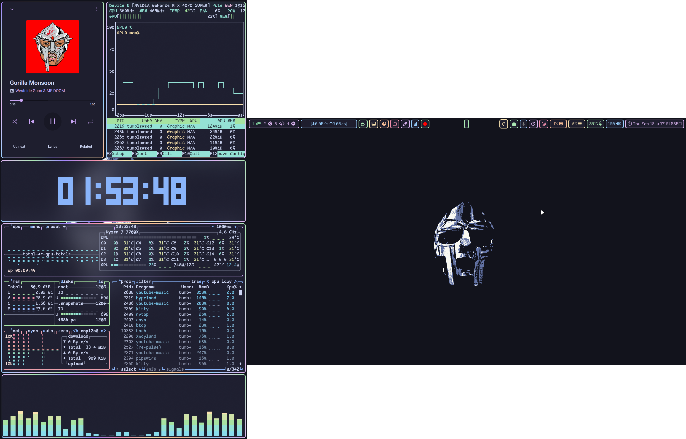

  
Screenshot 2

  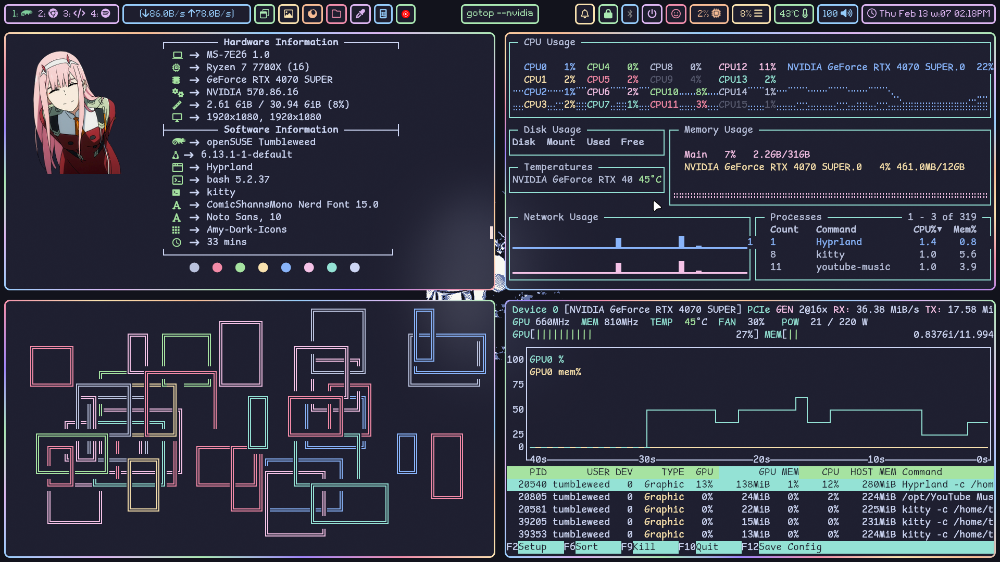

  
Screenshot 3

  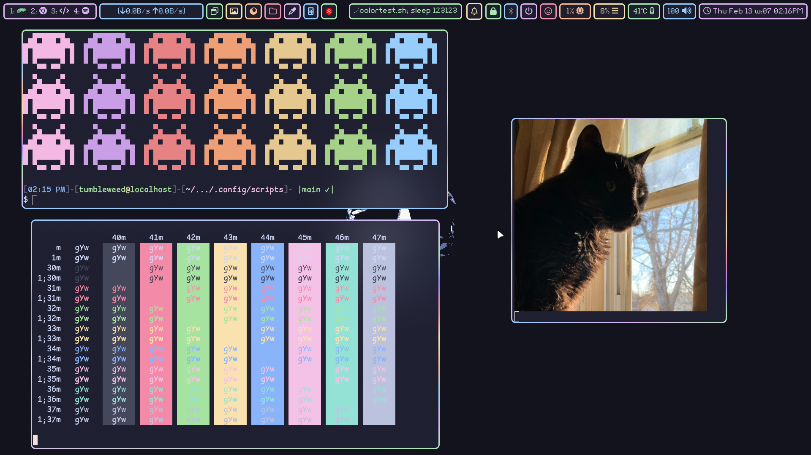

  
Screenshot 4

  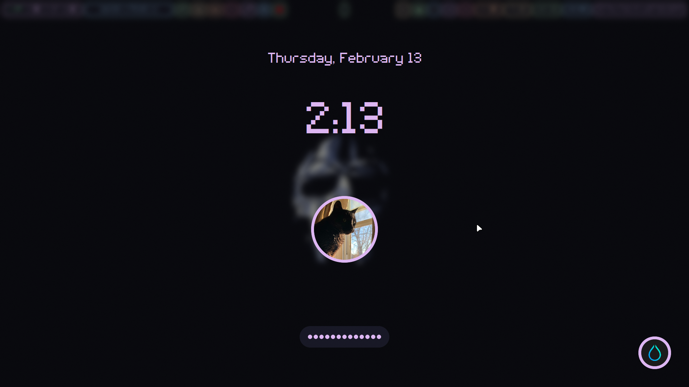

  
Screenshot 5

  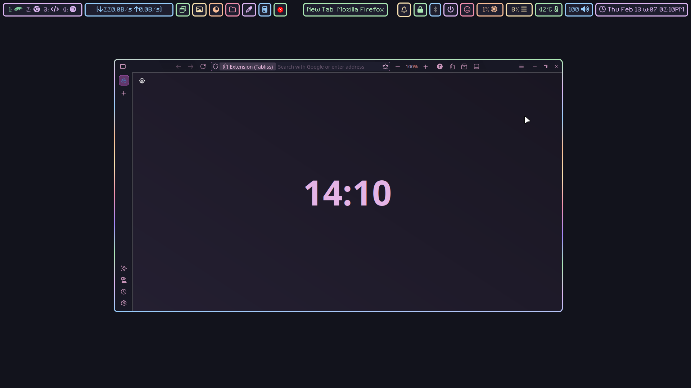

  
Screenshot 6

  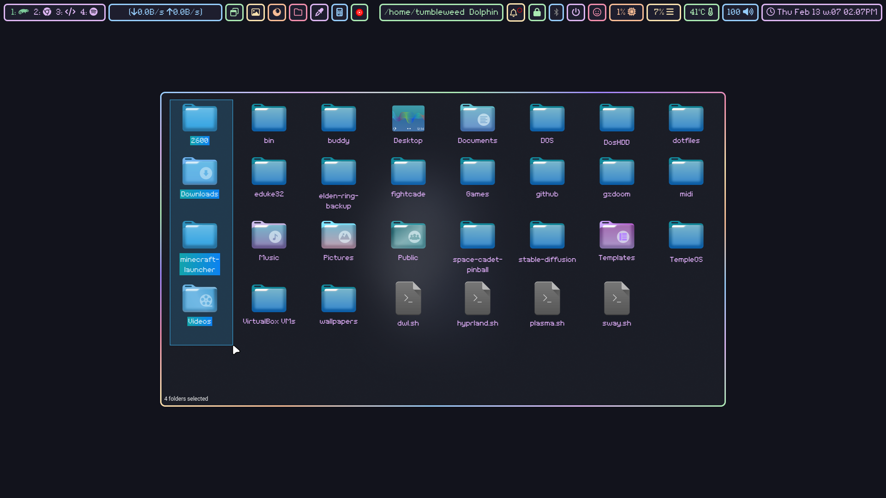

  
Screenshot 7

  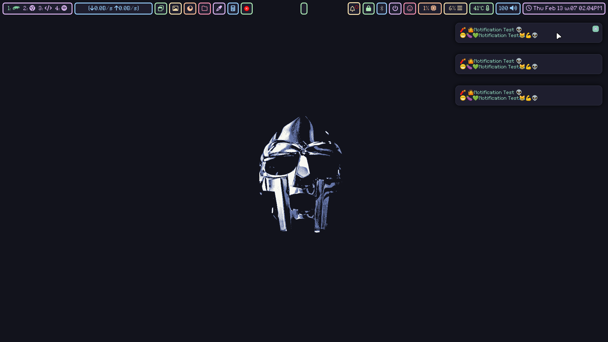

  
Screenshot 8

  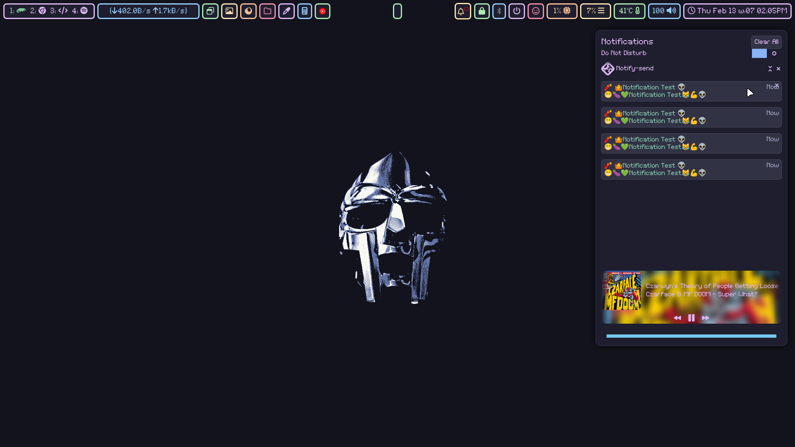

  
Screenshot 9

  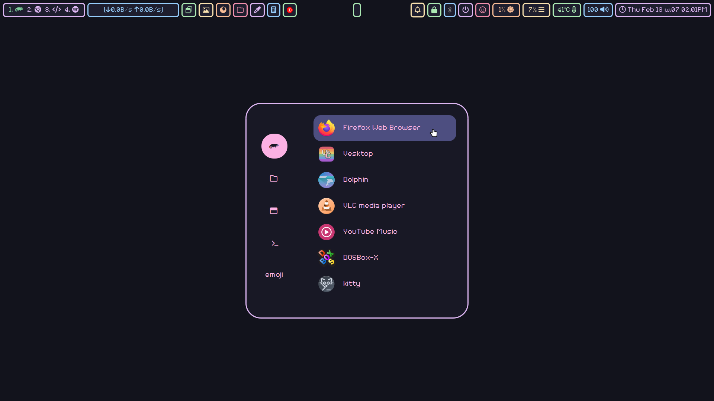

  
Screenshot 10

  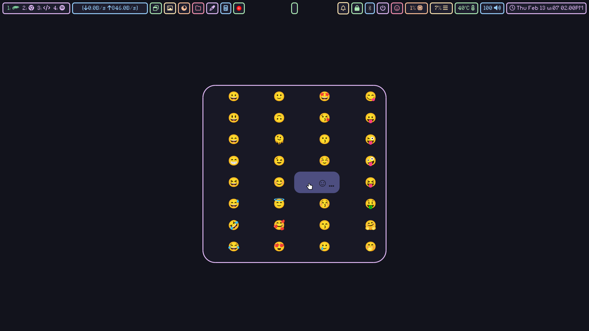

  
Screenshot 11

  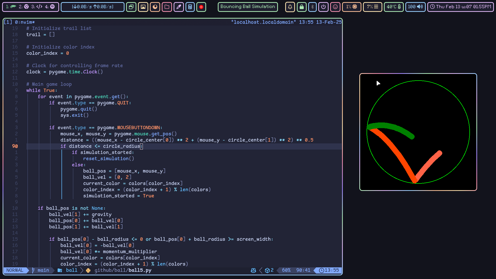

  
Screenshot 12

  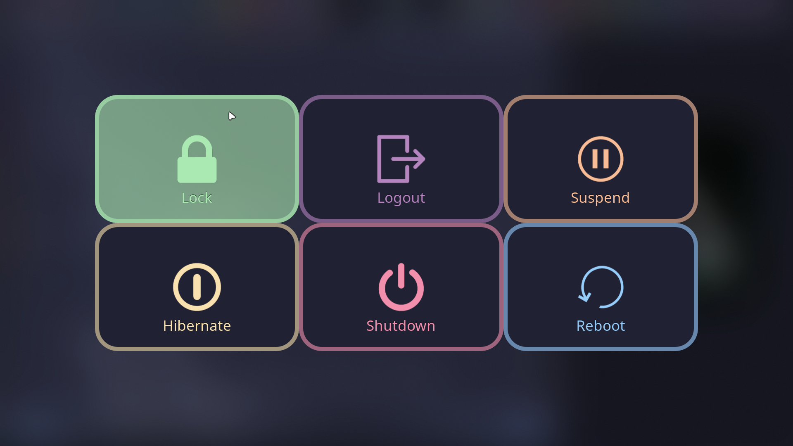

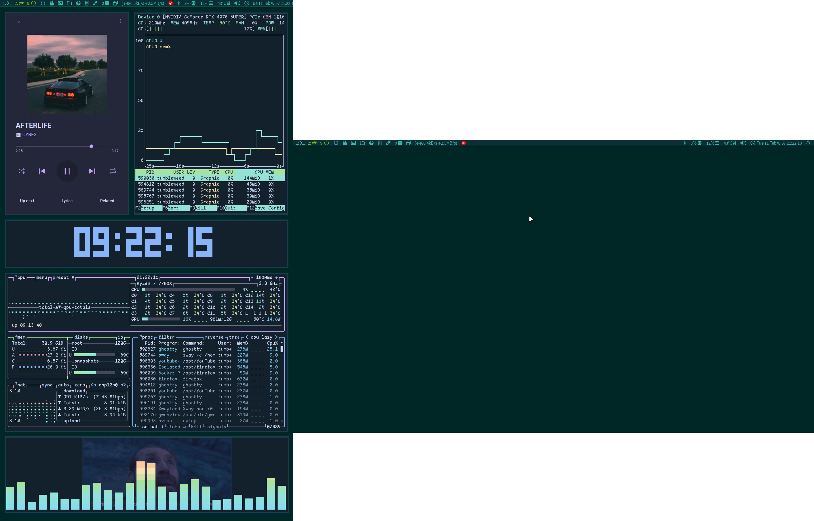
